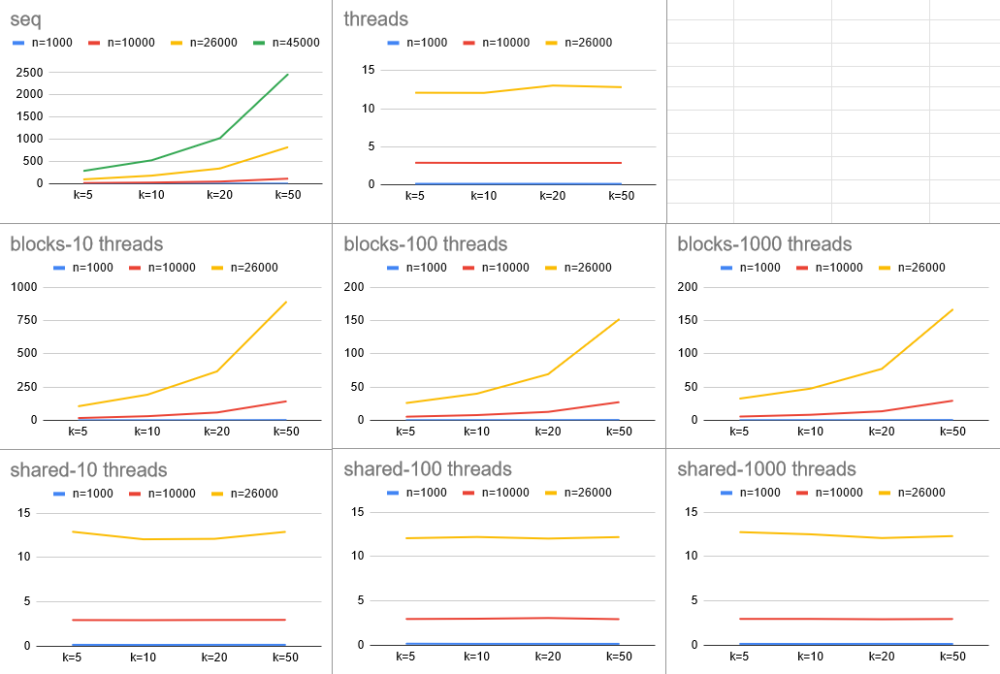

# Ising

### Homework 3

In this assignment we are tasked to code the evolution of an Ising model. The implementations are initially in C and progressively GPU processing elements are added, specifically speaking NVIDIA CUDA code in C, to make the whole simulation parallel and thus faster.

### Sequential

First we prototype the code in basic C to get a grasp of the fundamentals. The Ising model we are going code involves around a matrix in which each element has its own atomic spin. The elements follow Periodic boundary conditions meaning that there are no edge elements. The matrix wraps around both in the vertical and the horizontal directions creating an infinitely looping cell of atomic spins. The algorithm we apply takes the spin of an element's neighbors, including itself, and then if the majority is -1 the atom's spin becomes -1 in the next iteration. Also if the majority of the spins is 1 it becomes 1. The program runs for k iterations of this process and the matrix is nxn. For the actual code, we initialize two arrays **int\* current** and **int\* next**. We are going to read the values of the **int\* current** and write them to **int\* next**. Afterwards in the code we are going to be swapping the two to begin the next iteration of the code. Something that we need to pay attention to is the way we use a 1 dimensional pointer to represent the 2d matrix so that we can more easily implement the periodic boundaries and also speed up calculation omitting if then clauses on edge elements which would slow down the code.

#### Periodic boundary conditions

To deal with the edge case we devise this way of checking neighbor spins:
- current[((i - 1 + n) % n)*n + j] 
    - the element that is up
- current[((i + 1) % n)*n + j] 
    - the element that is down
- current[i*n + (j - 1 + n) % n] 
    - the element on the left
- current[i*n + (j + 1) % n] 
    - the element on the right
- current[i*n + j];
    - the element itself

Afterwards we some them all up to get the final atomic spin of the element according to the following condition:
```c
next[i*n + j] = sum > 0 ? 1 : -1;
```
Finally after all k iteration finish we free the two pointers and return 0.

### GPU with one thread per moment
It is the same principle as the sequential algorithm but here we calculate all of the values simultaneously:
```c
__global__ void isingCuda(int* currentCuda, int* nextCuda, int n) {
    
    // Calculate the global index of the thread
    int i = blockIdx.x * blockDim.x + threadIdx.x;
    int j = blockIdx.y * blockDim.y + threadIdx.y;
    if (i < n && j < n) {
        // Calculate the sum of neighboring spins
        int sum = currentCuda[((i - 1 + n) % n)*n + j] +
                currentCuda[((i + 1) % n)*n + j] +
                currentCuda[i*n + (j - 1 + n) % n] +
                currentCuda[i*n + (j + 1) % n] + 
                currentCuda[i*n + j];
        // Update the next state based on the sum
        nextCuda[i*n + j] = sum > 0 ? 1 : -1;
    }
}
```

### GPU with one thread computing a block of moments
Taking the previous code we modify the kernel function to allow threads to compute multiple elements of the matrix:
```c
__global__ void isingCuda(int* currentCuda, int* nextCuda, int n, int elementsPerThread) {
    // Calculate the global index of the thread
    int globalIdx = blockIdx.x * blockDim.x + threadIdx.x;

    // Each thread processes multiple elements
    for (int offset = 0; offset < elementsPerThread; offset++) {
        int idx = globalIdx * elementsPerThread + offset;
        if (idx < n * n) {
            int i = idx / n;
            int j = idx % n;

            // Calculate the sum of neighboring spins
            int sum = currentCuda[((i - 1 + n) % n)*n + j] +
                    currentCuda[((i + 1) % n)*n + j] +
                    currentCuda[i*n + (j - 1 + n) % n] +
                    currentCuda[i*n + (j + 1) % n] + 
                    currentCuda[i*n + j];
            // Update the next state based on the sum
            nextCuda[i*n + j] = sum > 0 ? 1 : -1;
        }
    }
}
```
Here i allows us to place ourselves on the correct row and j on the correct column. Offset is increased by one every iteration of this for loop to move as many time as needed to change as many elements as each thread is assigned.

### GPU with multiple thread sharing common input moments
Finally the shared memory code is pretty similar to the previous one but inside the kernel function there is a declaration of the shared memory:
```c
// Declare shared memory
extern __shared__ int sharedCurrent[];
```
And then the data needed for the calculations are transferred to this memory:
```c
// Each thread loads multiple elements into shared memory
    for (int offset = 0; offset < elementsPerThread; offset++) {
        int idx = globalIdx * elementsPerThread + offset;
        if (idx < n * n) {
            sharedCurrent[idx] = currentCuda[idx];
        }
    }
```

### Graphs
The excel file from which these data have been extracted from reside in the "media" folder of this repository. All four programs are run on Aristotelis HPC. The values we are testing are
- For number of iterations: k
- For matrix dimensions: n
- For the total number of threads used: numThreads

|k|n|numThreads|
|-|-|----------|
|5|10|10|
|10|100|100|
|20|1,000|1000|
|50|10,000|-|
|-|26,000|-|
|-|45,000|-|

The memory limit for Aristotelis was n=26,000 if we had to allocate memory for cpu and gpu pointers. However on the sequential code we only had to allocate memory for the cpu pointers so that raised the limit to 45,000.

<p align="center">
  
</p>

>for higher quality graphs and access to the raw data I recommend referring to the excel file

#### Sequential
The tests show that the sequential program can't compute very large amounts of data. After a certain point we get Segmentation error. For small matrices the times are about the same for the iteration values that are tested but setting higher matrix size results in the increase of execution time in an exponential way.
#### Threads 
Threads program times are stable no matter how many iterations there are and are only influenced by the matrix size.
#### Blocks
When speaking about the blocks program at high matrix sizes there is no time differentiation based on the number of iterations. However on smaller matrix sizes there is a clear increase in execution times as the number of iterations increases. On few threads this increase in execution time is greatly exaggerated.
#### Shared
The shared program has a lot in common with the threads program in terms of displaying stable times no matter the total iterations. Also the number of threads appointed to compute a block of moments does not seem to effect execution times at all.

### Tutorial
#### Aristotelis HPC
```bash
# Loading the compiler modules is a requirement for running 
# code on HPCs.
module load gcc/7.3.0 cuda/10.0.130
```

#### Makefile
The code is divided into 4 files:
- ising-seq.c
```bash
make seq
```
- cuda-threads.cu
```bash
make threads
```
- cuda-blocks.cu
```bash
make blocks
```
- cuda-shared.cu
```bash
make shared
```
In order to remove the executables:
```bash
make clean
```
>When launching them you are prompted to initialize 2-3 parameters: size, iterations, threads(only on blocks and shared executables).

External sources
----------------
- Cuda programming tutorial: https://www.youtube.com/watch?v=8sDg-lD1fZQ
- Cuda documentation from NVIDIA: https://docs.nvidia.com/cuda/cuda-c-programming-guide/index.html